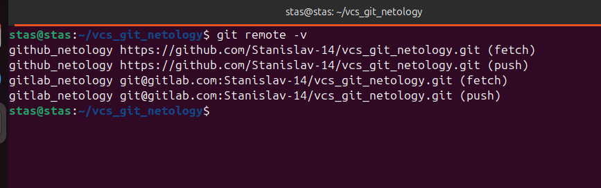
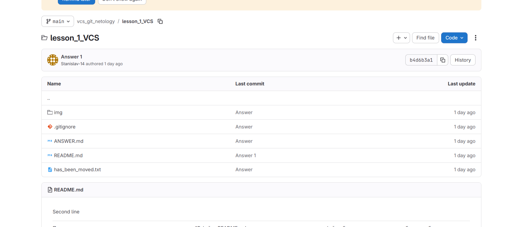
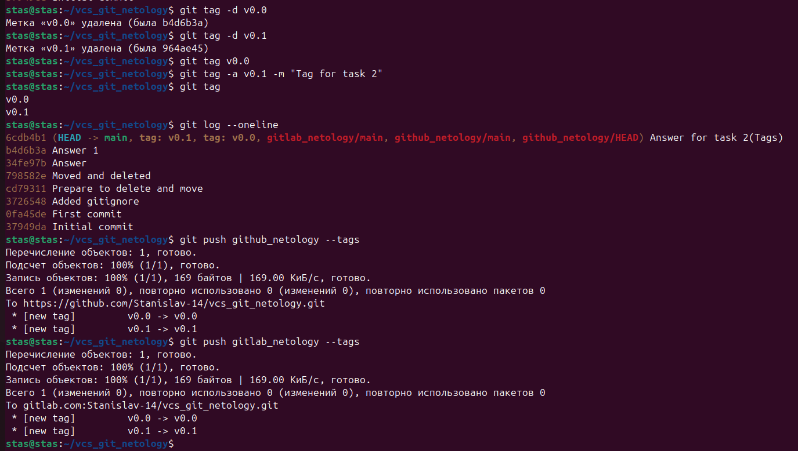
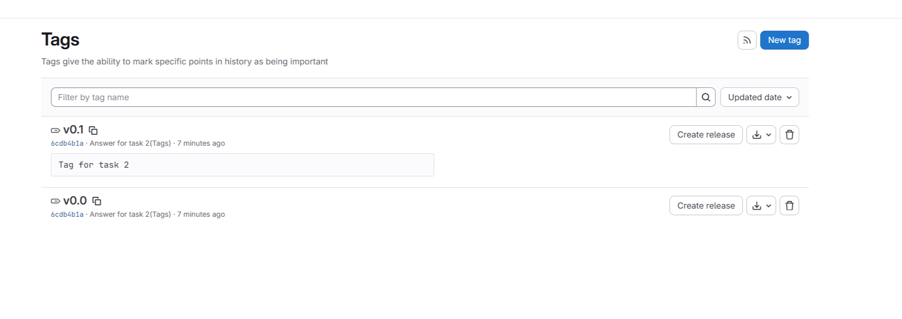
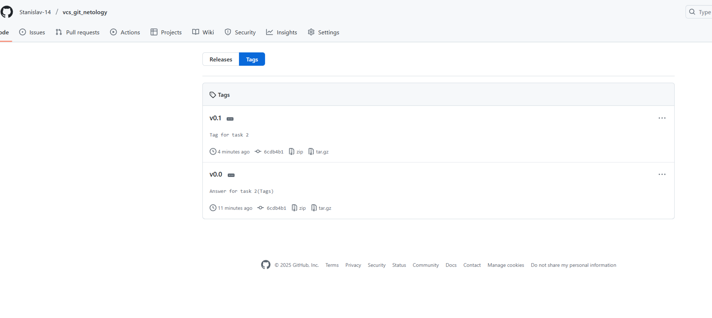
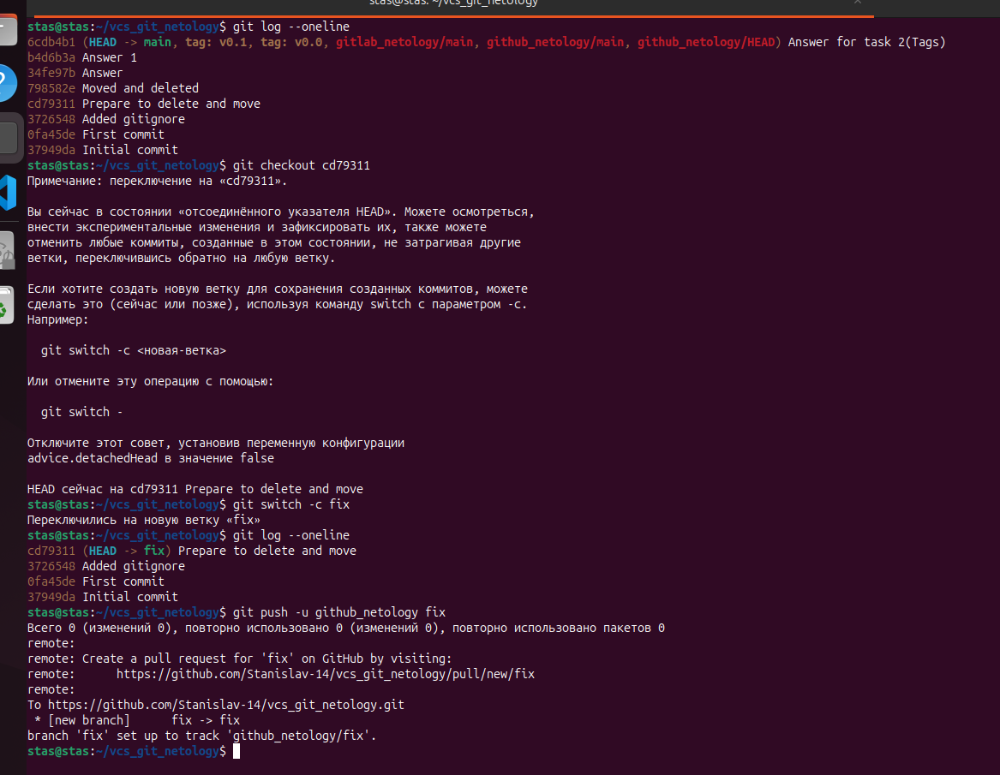
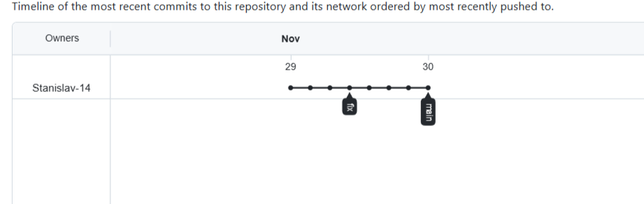
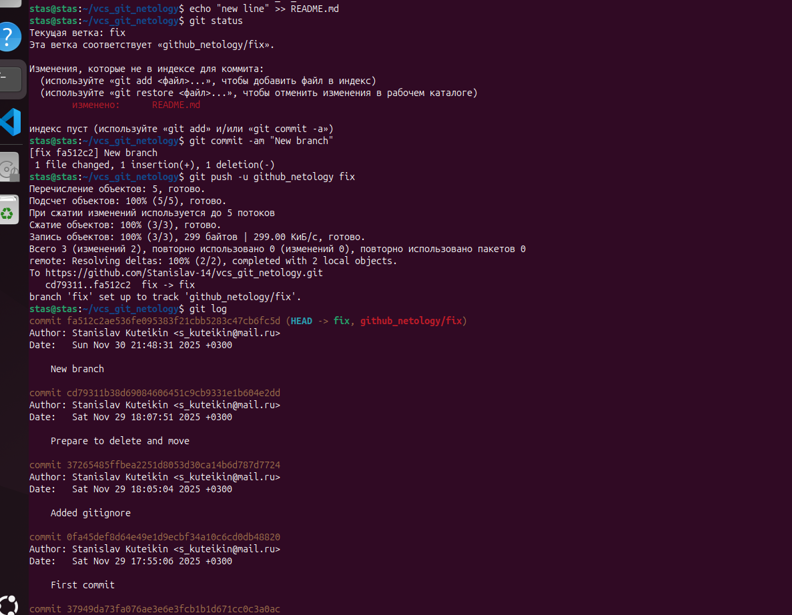
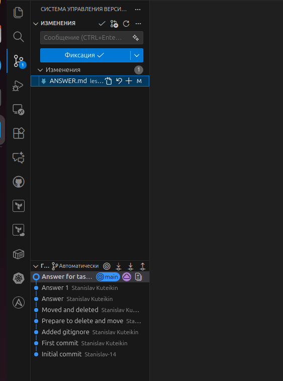

# Домашнее задание к занятию "`Основы Git`" - `Кутейкин Станислав`

**ЗДРАВСТВУЙТЕ!**

---
Все получилось кроме установки pycharm и регистрации на bitbucket, на bitbucket у меня нет почты без привязки к России, следовательно даже VPN не поможет, а в случае с pycharm можно было бы скачать с VPN-кой ее, но честно мне она особо не нравится, особенно по сравнению с VScode, тут тоже есть дополнения для GIT-та, так что тот же функционал можно выполнить, скриншот просто как пример показал, коммитить также можно. Ниже скриншоты всех действий, в задании с тегами немного затупил сначала, запушил изменения и теги оказались не на последнем комите, как требовалось по заданию, поправил. Gitlab подключал по ssh, github подключен через токен по https

---

### Задание 1

  

  

### Задание 2

  

  

  

### Задание 3

  

  

  

### Задание 4

  

---

**СПАСИБО ЗА ПРОВЕРКУ!**
