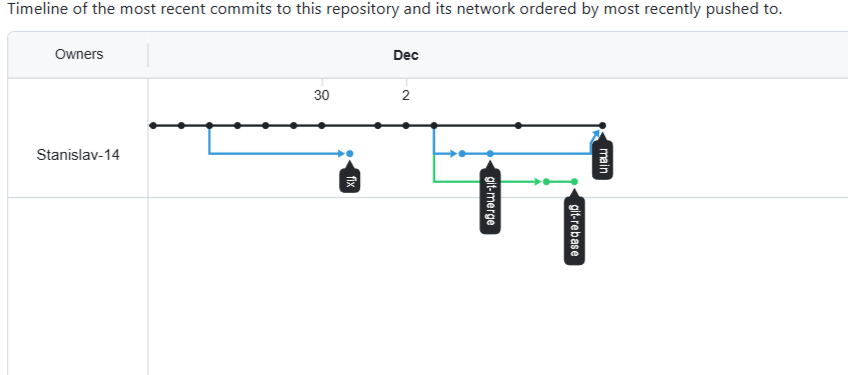

# Домашнее задание к занятию "`Ветвления в Git`" - `Кутейкин Станислав`

**ЗДРАВСТВУЙТЕ!**

---

Сегодня я что-то много тупил, надо бы читать все задание сначала, а не гнать впереди паровоза, скриншотов почти не делал, только один перед rebase, а так вроде делал все по заданию, не знаю правильный граф получился или нет  

---

### Задание 1

  

---

**СПАСИБО ЗА ПРОВЕРКУ!**
