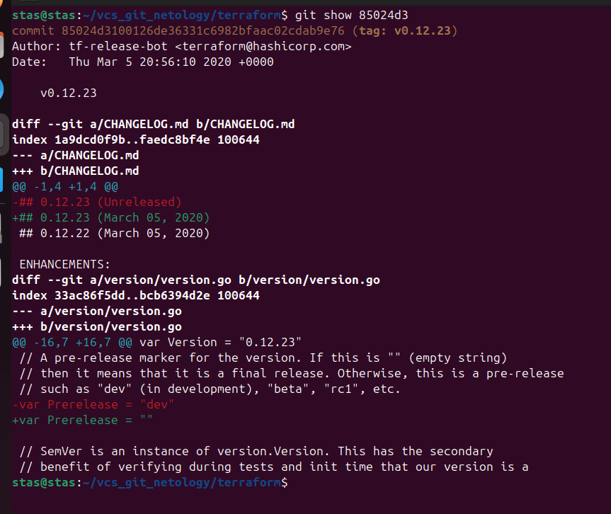
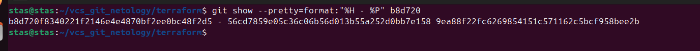
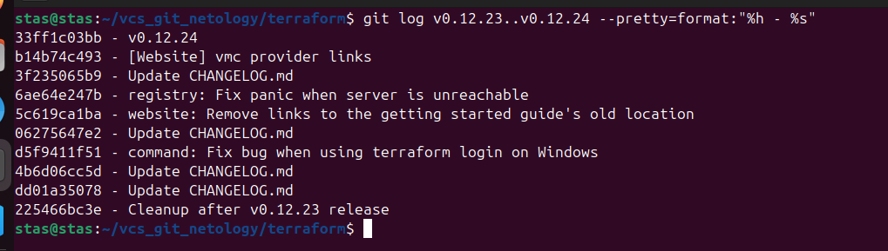
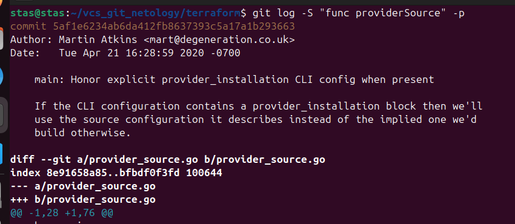
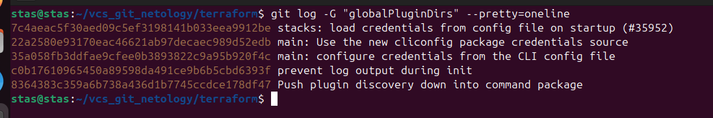
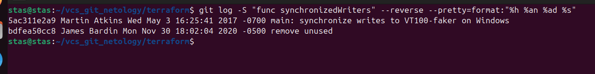

# Домашнее задание к занятию "`Инструменты Git`" - `Кутейкин Станислав`

**ЗДРАВСТВУЙТЕ!**

---

Ниже ответы и скриншоты разобью по вопросам, для более легкого понимания  

---

## Задание 1

Найдите полный хеш и комментарий коммита, хеш которого начинается на aefea.  

На скриншоте видно полный хэш и коментарий коммита

### Вопрос 1

Какому тегу соответствует коммит 85024d3?  

Тэг v0.12.23  
  

### Вопрос 2

Сколько родителей у коммита b8d720? Напишите их хеши.  
Родителей 2. Их хэши на скриншоте:  
  

### Вопрос 3

Перечислите хеши и комментарии всех коммитов, которые были сделаны между тегами v0.12.23 и v0.12.24.  

Тэг 24 включен в список, тэг 23 нет, после него идут все коммиты, итого коммитов между тэгами 9.  
  

### Вопрос 4

Найдите коммит, в котором была создана функция func providerSource, её определение в коде выглядит так: func providerSource(...) (вместо троеточия перечислены аргументы).  

На скриншоте виден комит, в котором была впервые создана функция:  
  

### Вопрос 5

Найдите все коммиты, в которых была изменена функция globalPluginDirs.  

На скриншоте все комиты сокращенно с коментариями:
  

### Вопрос 6

Кто автор функции synchronizedWriters?  

Автор функции Martin Atkins, даже по дате добавления видно и также если раскрыть комит, по изменениям видно, что добавлена была она им.  
  

---

**СПАСИБО ЗА ПРОВЕРКУ!**
